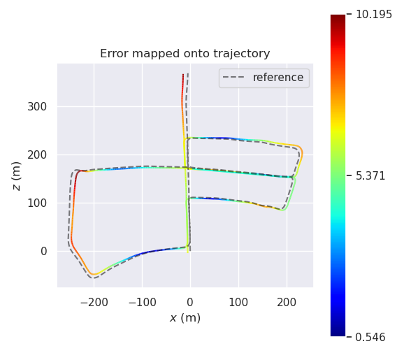

# ULNC SLAM

## Introduction
ULNC-SLAM is an abbreviation of Unsupervised Learning Network with Confidence SLAM. In this work, we present a laser-assisted unsuper-vised visual network to extract feature for SLAM. Building on a previous work which can predict dense depth and confidence, we feed RGB frames and confidence maps into our network to generate feature points that have value and can utilize reliable information from the laser. We partially modified ORB-SLAM2[ORB-SLAM2], (https://github.com/raulmur/ORB_SLAM2) to obtain a more accurate and robust SLAM system. Also, our system can be easily extended to monocular or stereo SLAM.

## Example
Performance UNLC features:

GCNv2:


## Related Publications

# Dependencies

## C++14 or C++0x Compiler
We use the new thread and chrono functionalities of C++14.

## Pytorch
We use [Pytorch](https://github.com/pytorch/pytorch) C++ api(libtorch) for deloying the UNLC. 

## Pangolin
We use [Pangolin](https://github.com/stevenlovegrove/Pangolin) for visualization and user interface. Dowload and install instructions can be found at: https://github.com/stevenlovegrove/Pangolin.

## OpenCV
We use [OpenCV](http://opencv.org) to manipulate images and features. Dowload and install instructions can be found at: http://opencv.org. 

**Required at least OpenCV4.5.1.**.

## Eigen3
Required by g2o (see below). Download and install instructions can be found at: http://eigen.tuxfamily.org. 

**Required at least 3.1.0**.

## DBoW2 and g2o (Included in Thirdparty folder)
We use modified versions of the [DBoW2](https://github.com/dorian3d/DBoW2) library to perform place recognition and [g2o](https://github.com/RainerKuemmerle/g2o) library to perform non-linear optimizations. Both modified libraries (which are BSD) are included in the *Thirdparty* folder.

# Preparation
Clone the code
```
git clone https://github.com/salt0107fish/ULNC_SLAM-master.git
```
Then build the project 
```
cd ULNC_SLAM-master
./build.sh
```
Make sure to edit `build.sh` pointing to your local libtorch installation. Edit `run_ulnc.sh` to check out how to run with ULNC_SLAM.

#Result
The ORB-SLAM2 localization result in KITTI05 is


The ULNC-SLAM localization result in KITTI05 is

