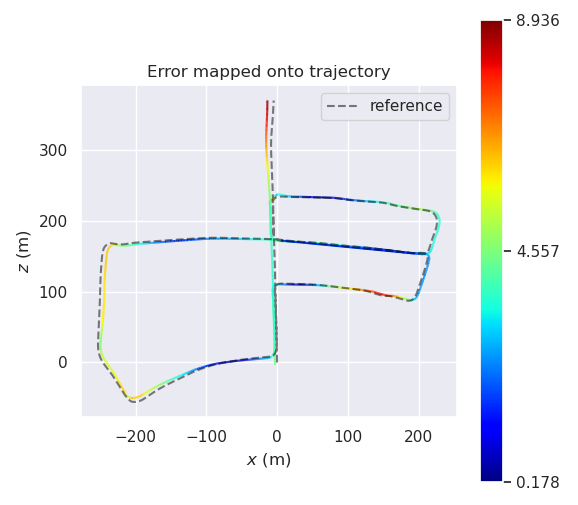

# UNF SLAM

## Introduction
UNF-SLAM(ULNC-SLAM) is an abbreviation of Unsupervised Network for Fusion SLAM. In this work, we present a visual-laser network to extract features for SLAM. Building on a previous work which can complete and predict dense depth and confidence, we feed RGB frames and confidence maps into our network to generate feature points that have value and can utilize reliable information from the laser. We partially modified [ORB-SLAM2], (https://github.com/raulmur/ORB_SLAM2) to obtain a more accurate and robust SLAM system. Also, our system can be easily extended to monocular or stereo SLAM.

## Example
Performance UNF features:


# Dependencies

## C++14 or C++0x Compiler
We use the new thread and chrono functionalities of C++14.

## Pytorch
We use [Pytorch](https://github.com/pytorch/pytorch) C++ api(libtorch) for deloying the UNF. 

## Pangolin
We use [Pangolin](https://github.com/stevenlovegrove/Pangolin) for visualization and user interface. Dowload and install instructions can be found at: https://github.com/stevenlovegrove/Pangolin.

## OpenCV
We use [OpenCV](http://opencv.org) to manipulate images and features. Dowload and install instructions can be found at: http://opencv.org. 

**Required at least OpenCV4.5.1.**

## Eigen3
Required by g2o (see below). Download and install instructions can be found at: http://eigen.tuxfamily.org. 

**Required at least 3.1.0**.

## DBoW2 and g2o (Included in Thirdparty folder)
We use modified versions of the [DBoW2](https://github.com/dorian3d/DBoW2) library to perform place recognition and [g2o](https://github.com/RainerKuemmerle/g2o) library to perform non-linear optimizations. Both modified libraries (which are BSD) are included in the *Thirdparty* folder.

# Preparation
Clone the code
```
git clone https://github.com/salt0107fish/UNF_SLAM-master.git
```
Then build the project 
```
cd UNF_SLAM-master
./build.sh
```
Make sure to edit `build.sh` pointing to your local libtorch installation. Edit `run_ulnc.sh` to check out how to run with UNF_SLAM.

# Result
The ORB-SLAM2 localization result in KITTI05 is


The UNF-SLAM localization result in KITTI05 is



RPE in Meters for KITTI 05 is:

  Configuration | max  | mean | median | min | rmse | sse | std
 --------------- | ----- | ------  | ------ | ------ | ------ | ------ | ------
 ORB-SLAM2  | 10.885378 | 0.107923 | 0.081827 | 0.003509 | 0.352939 | 134.779983 | 0.336033 
 UNF-SLAM  | 5.864444 | 0.059092 | 0.035320 | 0.002328 | 0.202411 | 74.852742 | 0.193593   

# Dataset

The data used for training and testing are from KITTI data set. The depth predictions and confidence maps are generated by Sparse-Depth-Completion Network .(https://github.com/wvangansbeke/Sparse-Depth-Completion)

The basic framework of UNF-SLAM comes from [ORB-SLAM2]. (https://github.com/raulmur/ORB_SLAM2)

# Acknowledgment

I would like to thank the reference workers I mentioned above, and I want to thank Jiaru Zhong for the spiritual support.
